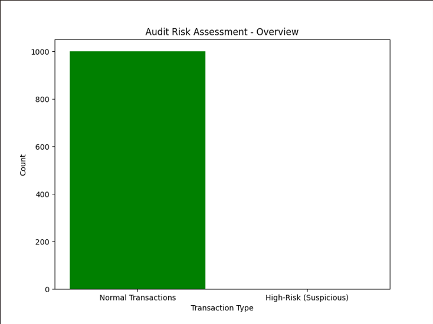
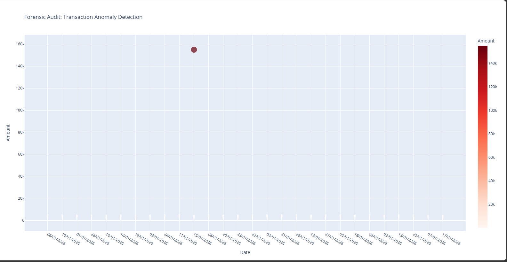
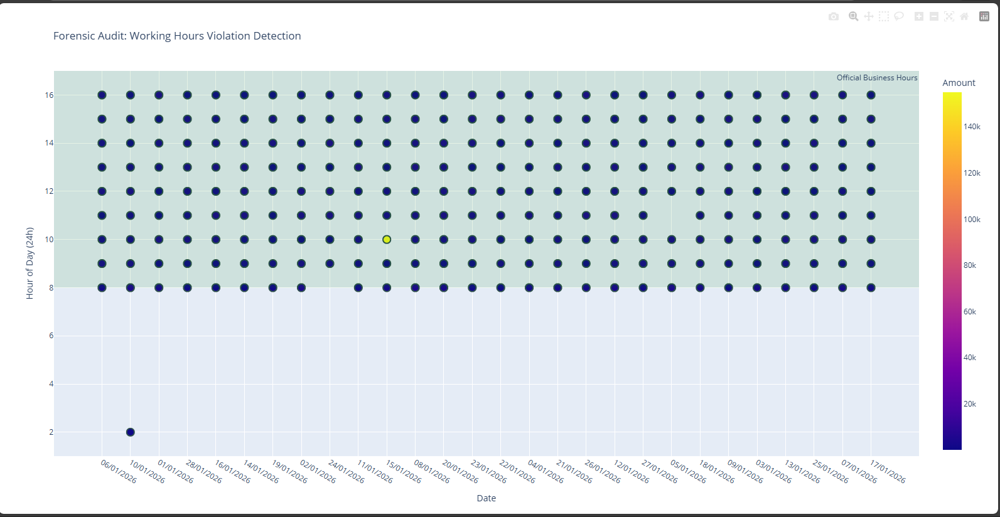
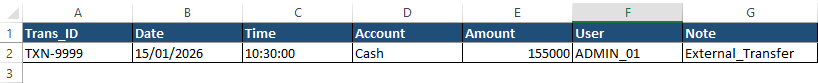
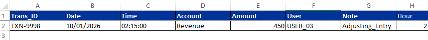

# 🛡️ Project Sentinel: Automated Forensic Audit Pipeline
> **Empowering Modern Finance with Python-driven Internal Controls and Anomaly Detection.**

---

## 🔍 Project Overview
In today’s data-heavy financial environments, manual auditing is no longer efficient. **Project Sentinel** is a professional forensic tool designed to automate the detection of financial fraud and errors. As an **Accountant & Data Analyst**, I built this pipeline to simulate corporate ledgers, inject fraudulent patterns, and use algorithmic filtering to catch "Red Flags" that traditional methods often miss.

---

## 🛠️ Technology Stack
- **Analysis Engine:** Python 3.10
- **Data Wrangling:** Pandas (Complex Filtering & Grouping)
- **Interactive Dashboards:** Plotly (Dynamic Forensic Visualization)
- **Professional Reporting:** XlsxWriter (Automated Corporate Excel Formatting)

---

## 🔍 Audit Logic & Visual Evidence

### 1. Audit Summary Overview 📊
The process begins by screening 1,000+ transactions and categorizing them into risk zones to provide an immediate overview of the control environment.

*Insight: The engine successfully isolated high-risk anomalies from standard operational data.*

### 2. High-Value Anomaly Detection (Amount Fraud) 🚨
Using threshold-based filters, the system identifies transactions that exceed authorized operational limits, specifically flagging the detected **$155,000** theft.

*Insight: Red outliers indicate critical breaches of internal financial controls.*

### 3. Temporal Forensic Audit (Time Fraud) 🌙
By analyzing time-stamps, the system identifies "Ghost Entries" posted outside official business hours.

*Insight: A suspicious entry was flagged at **2:00 AM**, far outside the green "Official Business Hours" zone.*

### 4. Professional Corporate Reporting (Excel Export) 📈
Findings are exported into a "Ready-to-Present" Excel file, formatted with corporate styling and conditional highlights for management review.

#### 🔴 High-Value Alerts Sheet

#### 🌙 Night-Shift Violations Sheet

---

## 📂 Project Structure & Scripts
The `/scripts` folder contains the full logic of the forensic lab:
- **`generate_data.py`**: Synthetic ledger engine with injected fraud patterns.
- **`audit_analysis.py`**: Core engine for identifying amount-based anomalies.
- **`time_audit.py`**: Forensic time-series analysis for unauthorized entries.
- **`beautify_excel.py`**: Automated Excel formatting with Corporate UI.
- **`dashboard.py`**: Summary visualization engine.
- **`interactive_audit.py`**: Interactive Plotly dashboard developer.

---

## 👨‍💻 Created by
**Maher Al-Momani** - Accountant & Financial Data Analyst 🎓
*Bridging the gap between Financial Governance and Modern Technology.*
